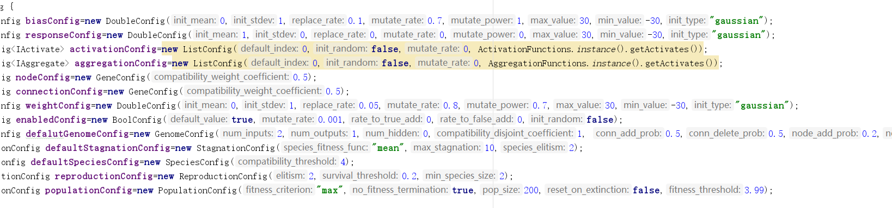
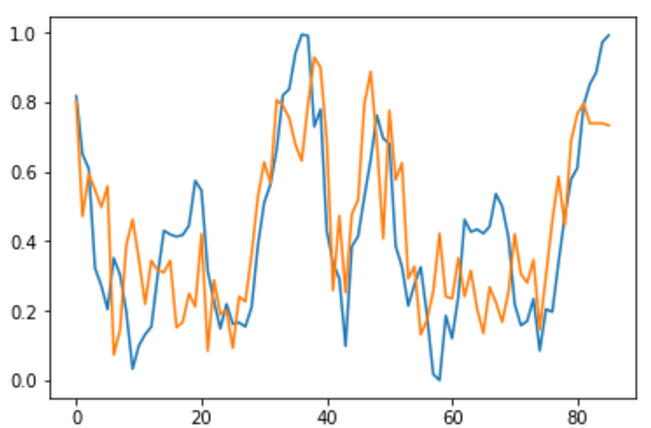
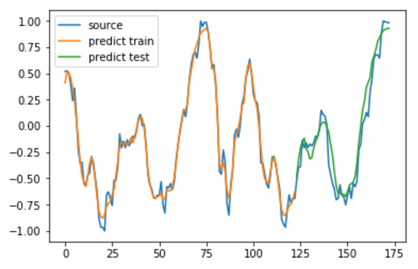

这个算法效果不是很好，用pta的数据对我的代码和网上官方的代码都试了一下，效果都不是很理想，误差好的时候才有0.03，而且耗时比较长，应该没有普通的神经网络好
单纯用这种方法处理我们的数据的方法不是很行得通
而且我的代码很容易产生更复杂的网络结构，而官方的代码不容易产生复杂的网络结构
这种方法仍然需要考虑很多超参数的问题，而且很容易使得算法得到的最优的解

网上一般把NEAT算法当作寻找神经网络最优结构，权值的更新仍然配合普通的反向传播，而我的代码和官方的这个都没有采用反向传播，原因是用java比较难写所有东西从头写需要耗费很多不必要的时间

算法在寻找最优网络结构的时候的本质还是用遗传算法解决组合优化问题，而不同的是其优化的搜索空间是可增长的，所以这种方法的缺点仍然是当前的决策不一定保证在整个过程看来是最优的决策，而其搜索空间是不固定的也不能简单用现有的动态规划的方法来求解，很容易陷入局部最优，像NEAT这种随机算法的解决方案是用足够多的种群尽量覆盖到最多的可搜索空间，这样就使得需要更多的计算时间，而结构复杂的网络结构的前馈仍然很耗时间

这种算法跟适合于处理智能agent在新环境下的适应问题

用java做实验很耗费时间，java不适合于快速迭代的研究性环境

---
NEAT的最终结果：

普通LSTM结果：

由图可知，差别还是很大的